# 公有云OpenClaw与云之家集成教程

## 1.购买云服务器

公有云这里以阿里云服务器为例。附：[阿里云-轻量云服务器购买地址](https://www.aliyun.com/benefit/scene/moltbot)

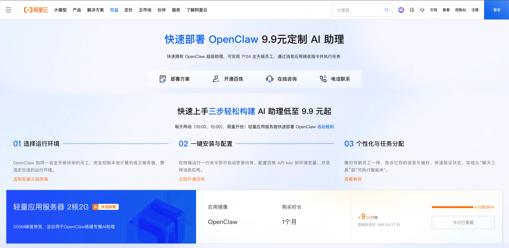

## 2.部署最新版本OpenClaw

- 进入服务器实例

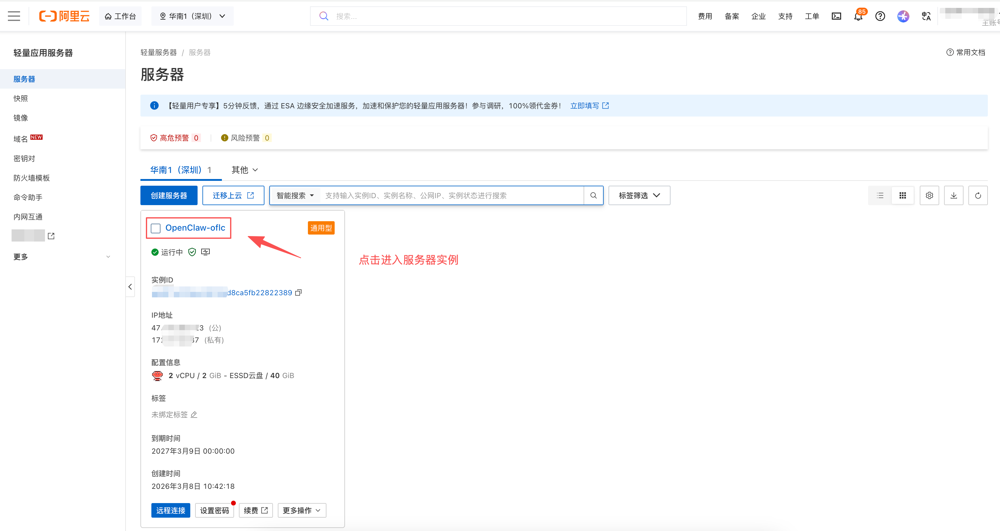

- 重置系统-获取最新版本OpenClaw镜像

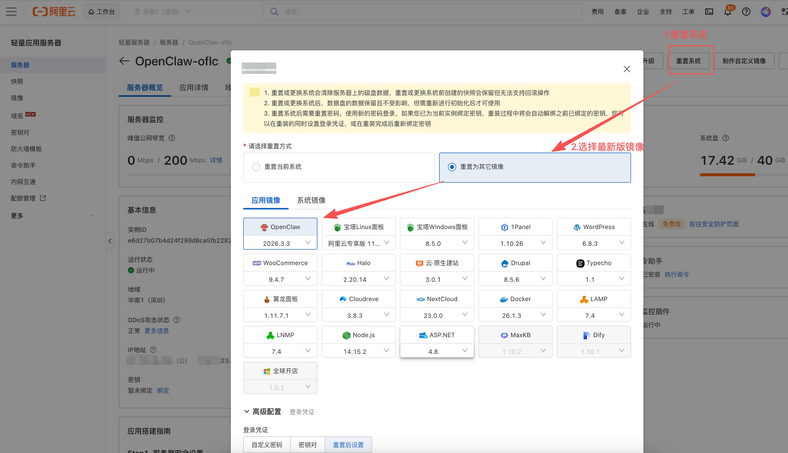

- 确认重置 - 等待约1分钟后 - 重置成功

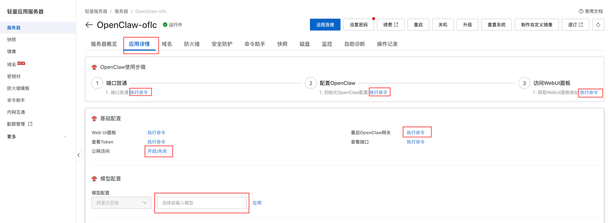

依次点击【端口放通】-【配置OpenClaw】(配置LLM API Key) - 【公网访问】 - 【模型配置】- 【重启OpenClaw网关】- 【访问WebUI面板】可在公网访问OpenClaw的WebUI。

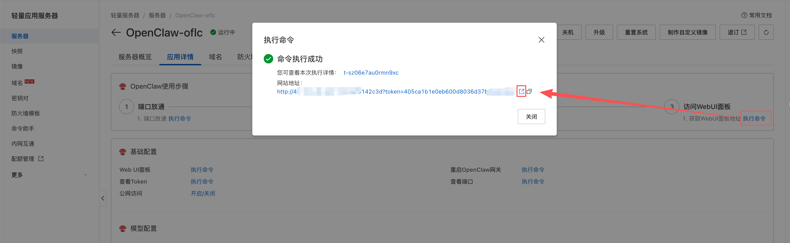

- 打开WebUI - 聊天 - 能正常对话则代表OpenClaw部署成功。

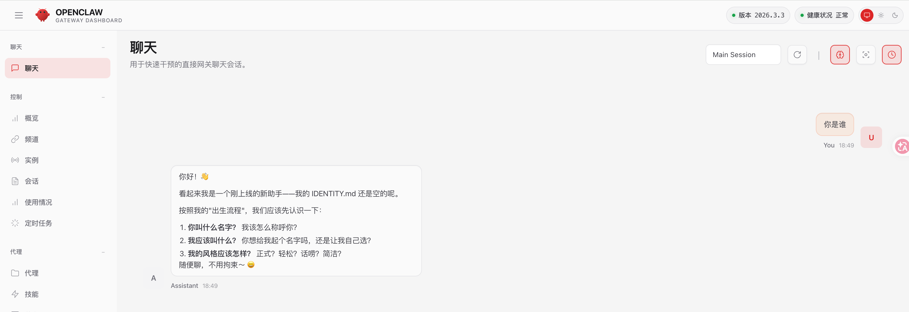

## 3.OpenClaw与云之家集成

> 由于云之家Channel暂不支持WebSocket长连接（类似飞书），所以如果是本地OpenClaw与云之家的话，需要先通过ngrok将本地OpenClaw暴露到公网，这里以阿里云公网IP OpenClaw举例。

- 远程连接服务器终端

  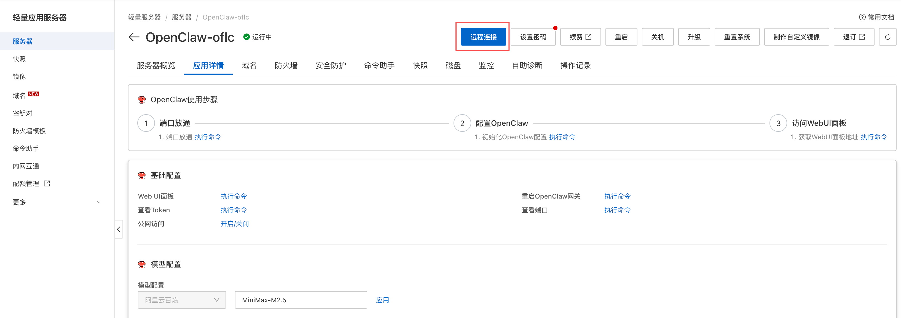

- 下载openclaw-yzj-main.zip安装包

  > 有时在服务器上wget网络超时，可直接本地下载，再手动上传到服务器。

  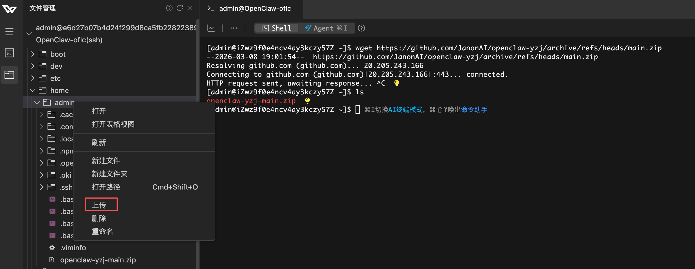

- 安装openclaw-yzj-main.zip

  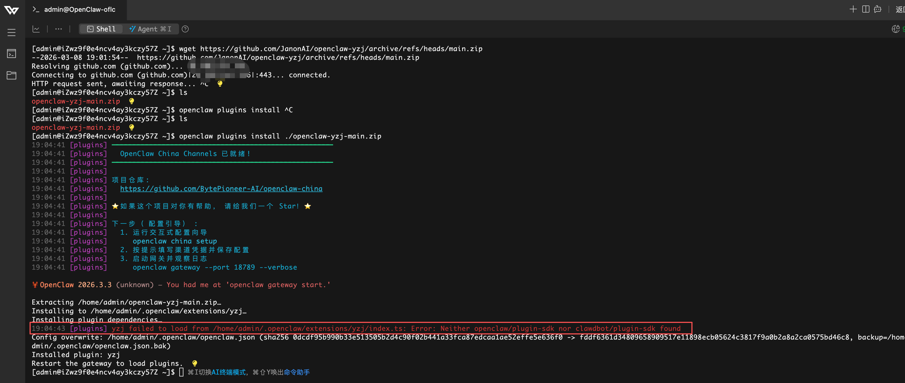

  > :star:要注意这一步安装是否成功，如果报错如图，则需要手动更新插件依赖，否则后续无法配置yzj插件。​
  >
  > ```shell
  > #进入报错目录
  > cd /home/admin/.openclaw/extensions/yzj/
  > #更新依赖(阿里云服务器上pnpm比npm更好使)
  > pnpm install
  > ```
  >
  > 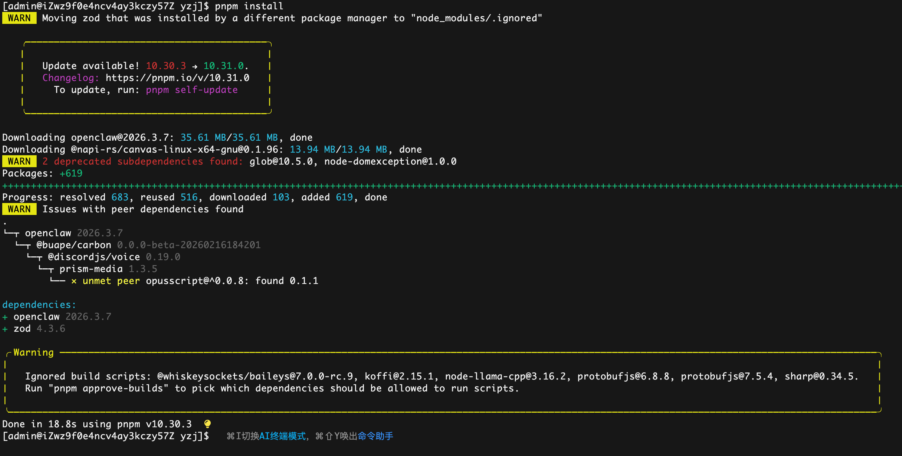
  >
  > 依赖安装成功后，重启openclaw gateway
  >
  > ```shell
  > #重启openclaw gateway
  > openclaw gateway restart
  > #检查yzj插件安装是否成功
  > openclaw plugins list
  > ```
  >
  > 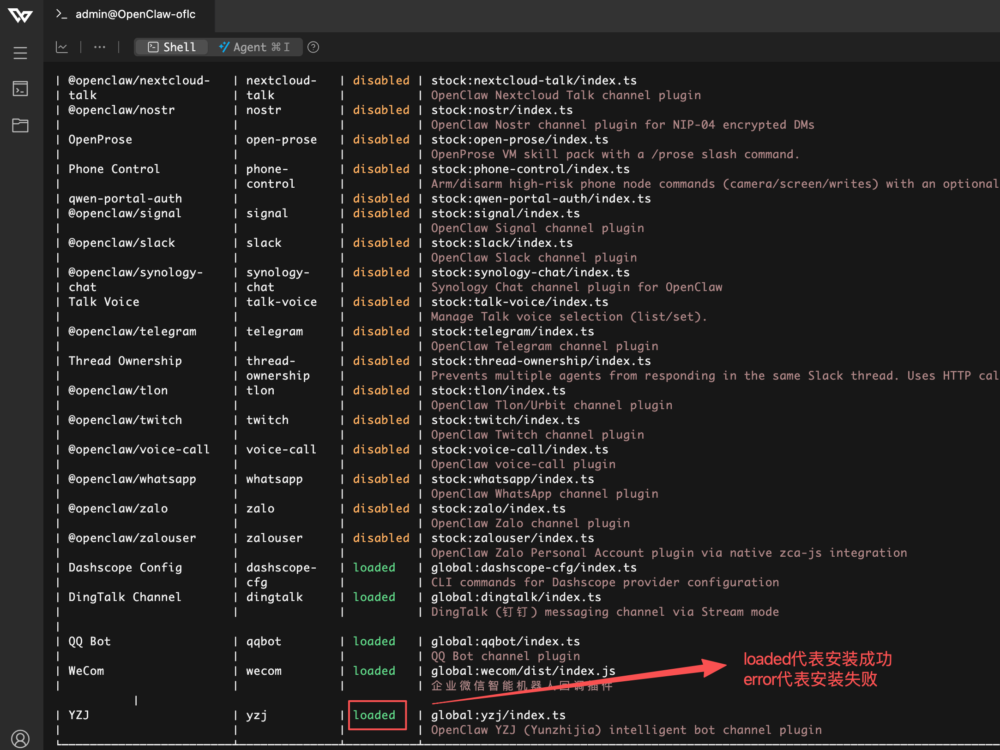

- 配置yzj插件

  > 若openclaw plugins list中的YZJ是error状态时，WebUI中是不会出现YZJ Robot的。

  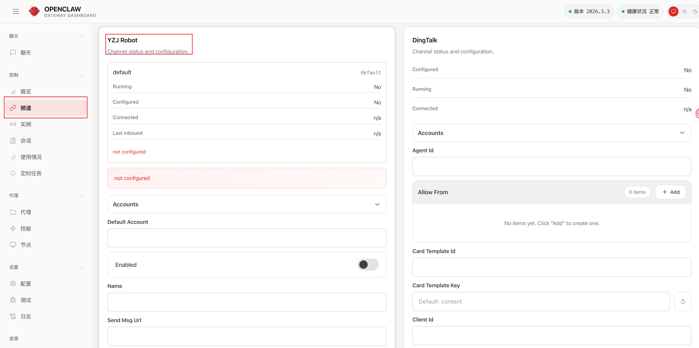

  

- Save - OpenClaw Gateway会自动重启，待重启成功后

```shell
#浏览器访问以下地址，如果显示【OK】则可以去云之家群组创建【对话型机器】人了
http://${你的OpenClaw WebUI公网IP及端口}/yzj/webhook
```

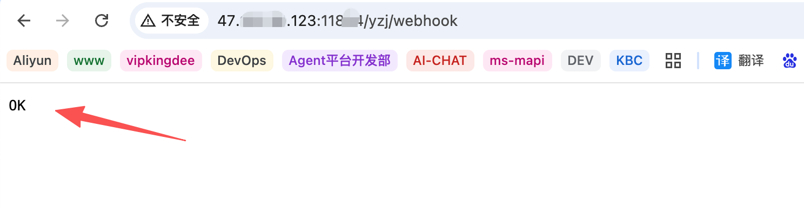

- 创建【对话型机器人】

    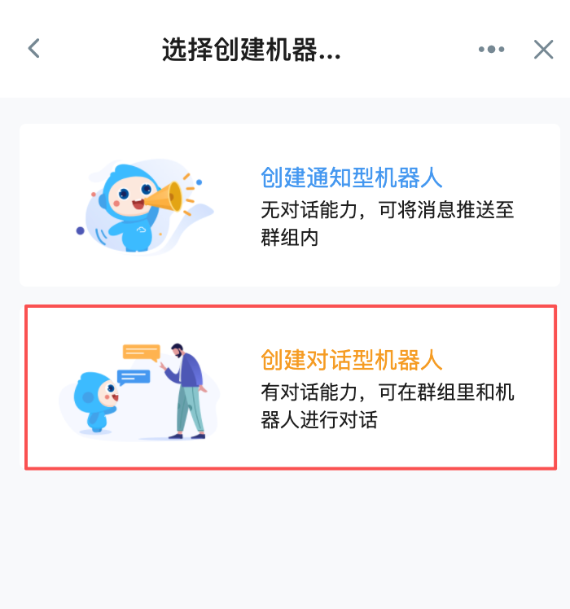

  > 消息接收地址：填写`http://${你的OpenClaw WebUI公网IP及端口}/yzj/webhook`，这时就能创建成功了。

   

   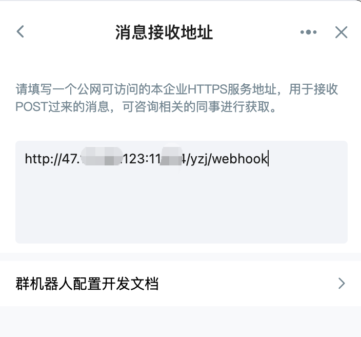

- 机器人创建成功后，将webhook地址回填至OpenClaw YZJ插件中的Send Msg Url中，否则机器人是不会回复你的消息的。

    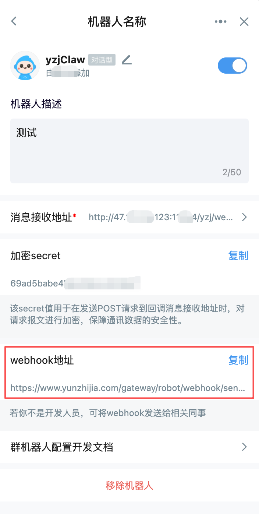

​	复制webhook地址回填至Send Msg Url中，就配置完成了！

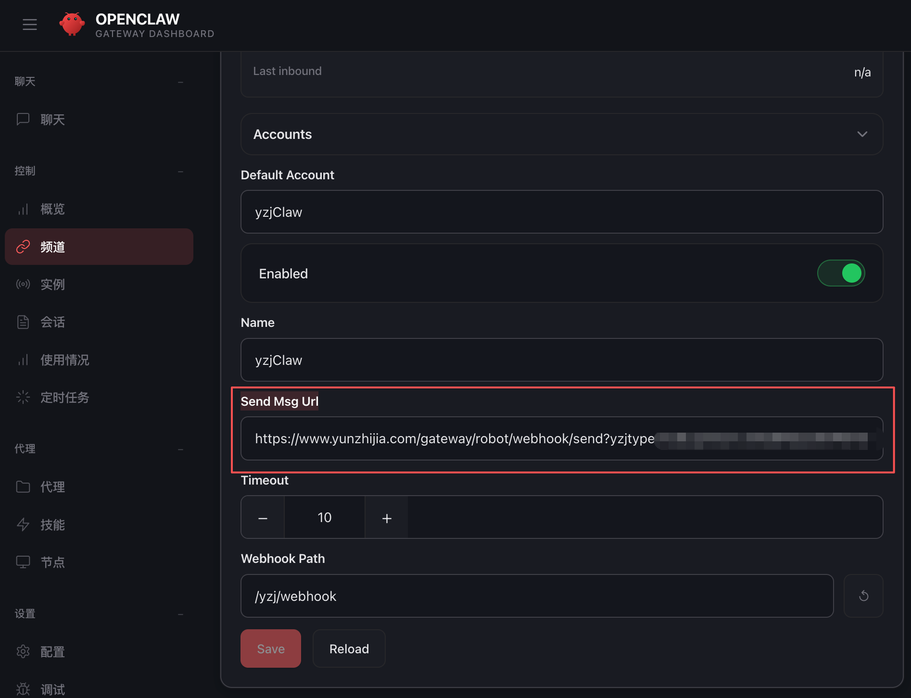

## 4.云之家群聊测试

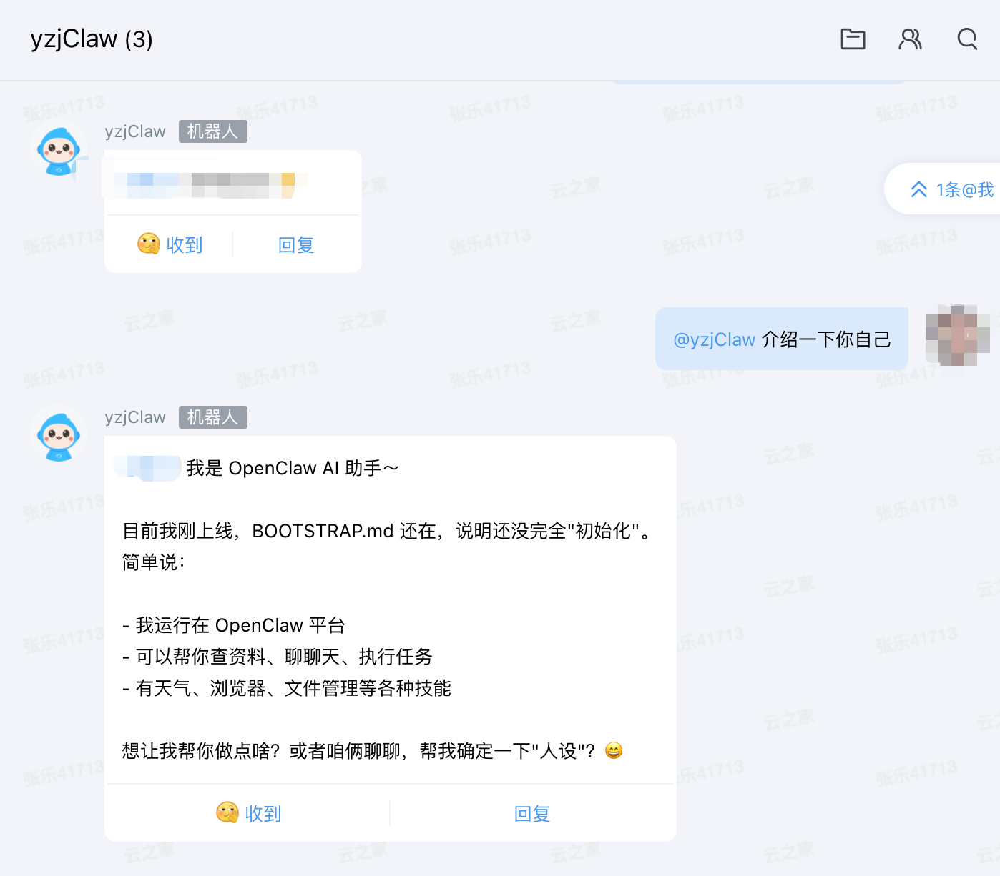

到这里，公有云OpenClaw与云之家集成就完成了~
